# dsh-pipeline

DeepSeek Harness（dsh）多节点工作流编排插件 —— 回应官方讨论
[#7704](https://github.com/deepseek-ai/deepseek-harness/discussions/7704)：
把"每轮对话手动换模型、挂技能、贴提示词、复制上一步结果"的重复流程，
定义成一份可复用、可进 git 的 JSON 流水线，一条命令编译并运行。

每个节点独立声明 prompt / model / skills，节点间自动传递输出，失败有策略、
取消能干净退出；Web 端提供零手写 JSON 的表单编辑器与运行入口，
会话流内实时渲染节点链运行卡（逐节点状态、耗时、token 用量、双模型成本对比）。

> 社区第三方插件，非官方出品。要求 dsh **≥ 0.2.0-rc.1**（npm `next` 标签）。

## 特性

- **流水线即文件**：定义存放在工作区 `.dsh/pipelines/<name>.json`，纯 JSON、可审查、可分享（FR-1）
- **确定性编译**：定义 → IR → 官方 workflow 引擎脚本（普通 JS，无 eval），快照逐字节冻结（FR-2）
- **节点级模型路由**：每节点独立 `provider`/`model`，成本敏感场景可把大纲/成文路由到不同档位（FR-6）
- **节点内多条 prompt**：`prompts[]` 顺序投递，中间结果经 `{{prev}}` 链式传递（FR-7）
- **跨节点模板变量**：`{{input}}`、``、`{{prev}}` 自动注入上游输出（FR-4/T4）
- **显式 DAG**：`dependsOn` 覆盖隐式串接，支持汇聚；引用缺失/环/自依赖编译期拒绝（FR-2）
- **结构化输出**：节点级 `outputSchema`（引擎 schema 子集），下游可安全插值（FR-2）
- **技能注入**：节点级 `skills[]` 经 `ctx.skills` 解析内容进提示词，缺技能 fail-loud（FR-10）
- **失败策略**：节点级 `abort`（默认）/ `skip` / `retry:n`，流水线级默认策略（FR-9）
- **取消传播**：会话中断/AbortSignal 经引擎共享 signal 传播到全部受管子 agent，干净结算（FR-8）
- **能力探测先行**：provider 缺 `agentOptions`/`outputSchema` 通路时运行前给可读错误，绝不静默降级（FR-12）
- **Web 编辑器**：设置区流水线列表 + 表单式节点编辑（模型下拉读 catalog、技能注入说明），零手写 JSON（FR-13）
- **运行入口页**：选流水线 + 填输入 + 一键运行，发起后进会话流看运行卡（FR-13）
- **实时运行卡**：`pipeline-run` 会话节点卡——节点链状态徽章、每节点耗时/token、双模型用量对比徽章（FR-14/15）
- **错误信息 en/zh**：插件配置 `locale`，默认 en
- 编译期闸门（fail-loud，不静默忽略）：节点级 `tools` 路由与 `model.reasoningEffort`——
  当前引擎 seam 不提供对应通路（见[限制](#限制)）

## 架构

双半包（host lib/ + client bundle），全部走官方 seam：

```mermaid
flowchart LR
  subgraph def["定义（可复用文件）"]
    A[".dsh/pipelines/*.json"]
  end

  subgraph host["宿主半 lib/"]
    S["schema 校验"] --> IR["IR + 编译器"]
    IR --> |"普通 JS 脚本（无 eval）"| R["runner<br/>能力预检 + 结果映射"]
  end

  subgraph client["客户端半 client bundle"]
    E["设置区编辑器<br/>列表 + 表单节点编辑"]
    P["运行入口页"]
    C["pipeline-run 运行卡<br/>状态/耗时/token/成本徽章"]
  end

  A --> S
  E -->|"store RPC<br/>/api/dsh-pipeline/*"| S
  P -->|"POST /run"| R
  R --> W["workflow-ptc 引擎<br/>（共享沙箱 PTC 运行时）"]
  W --> AG["子 agent × N<br/>每节点独立 model / skills"]
  W -. "workflow/agent-start&#124;end" .-> REC["run-recorder"]
  REC -. "session.append 持久日志" .-> C
```



- **命令/工具入口**：`/pipeline list|show|run` 用户命令（不经模型轮次）与面向模型的
  `pipeline` 工具（参数 `{name, input}`），均在会话内发起，产物经官方引擎运行；
  子 agent 继承父会话工作区
- **运行卡事件通路**：与官方 tool-workflow 同款——宿主 recorder 监听引擎事件，写父会话
  持久日志（`pipeline-run/run-start|agent-start|agent-end|run-end`），浏览器从日志重放纯折叠；
  事件断连/重连后卡片不脏渲染。token 聚合自子会话 usage，成本徽章按声明路由分组（含失败尝试的真实开销）
- **bundle 契约**：懒 CJS `window.__ModuleLoader__.load`，external 仅平台种子表 + locale 包；
  插件 bundle patch 只翻转 web profile 默认禁用的 `workflow-ptc` 引擎开关，官方面向模型的
  `workflow` 工具保持原样，两者共存

## 快速开始

### 前置要求

- Node ≥ 20
- dsh ≥ **0.2.0-rc.1**（0.2.0-rc.1 在 npm `next` 标签：`npm i -g @deepseek-ai/dsh@next`；
  `latest` 仍指 0.1.x，无法运行本插件）
- 已配置可用的模型 provider（子 agent 走 dsh 自身模型配置；本插件不内置任何 key）

### 安装

```sh
dsh plugin --profile web add dsh-pipeline
```

包内含预构建产物，安装即用，无需本地构建。安装时插件的 bundle patch 会自动启用
web profile 默认禁用的 `workflow-ptc` 引擎（本插件是它的专用消费方）。

### 定义第一条流水线

把下面的 JSON 存为工作区 `.dsh/pipelines/three-node-two-models.json`
（大纲用便宜路由、复查走默认路由、成文用 reasoner）：

```json
{
  "name": "three-node-two-models",
  "description": "Outline on the cheap route, review on the parent route, write on the reasoner route.",
  "nodes": [
    {
      "id": "outline",
      "label": "Outline",
      "prompts": ["Write a concise bullet-list outline for a short article about {{input}}."],
      "model": { "provider": "deepseek", "model": "deepseek-chat" }
    },
    {
      "id": "review",
      "label": "Review",
      "prompts": ["Review the outline for factual risks. Return numbered revision notes.\n\n{{outline}}"]
    },
    {
      "id": "write",
      "label": "Write",
      "prompts": ["Write the final short article about {{input}}.\n\nOutline:\n{{outline}}\n\nNotes:\n{{review}}"],
      "model": { "provider": "deepseek", "model": "deepseek-reasoner" }
    }
  ]
}
```

定义格式完整字段（`prompts[]` / `model` / `skills` / `dependsOn` / `outputSchema` /
`failurePolicy` / `retry` / `options.defaultFailurePolicy`）见
[`data/pipelines/`](./data/pipelines/) 的 7 份示例与 GitHub 仓库
[`plan/03-模块详设.md`](https://github.com/yuluo554/dsh-pipeline/blob/main/plan/03-%E6%A8%A1%E5%9D%97%E8%AF%A6%E8%AE%BE.md)。

### 运行

```sh
/pipeline list                     # 列出已保存流水线
/pipeline show <name>              # 打印定义 + 校验状态
/pipeline run three-node-two-models <主题...>   # 直接运行（不经模型轮次）
```

或直接对模型说"用 three-node-two-models 流水线写一篇关于 ×× 的文章"，
让模型调用 `pipeline` 工具发起；也可在 Web 端 **设置 → 流水线** 的运行入口页选流水线一键运行。
运行发起后会话流内出现实时运行卡：节点链状态徽章、每节点耗时与 token、双模型用量对比。

### 本地开发回路（从源码）

```sh
git clone <本仓库>
cd dsh-pipeline
pnpm install && pnpm build
# 在本仓库的父目录执行（相对路径 link 安装）：
dsh plugin --profile web add ./dsh-pipeline
dsh --profile web --dump-config   # 应可见 "# == dsh-pipeline" 层 + workflow-ptc enabled
```

卸载：`dsh plugin --profile web remove dsh-pipeline`（层消失、注册随 effect 注销）。

## 内置基准评测

全部离线可重复（零 API 依赖、零模型调用），`pnpm bench` 一条命令出全部指标：

| 基准 | 输入 | 判据 | 当前指标 |
|---|---|---|---|
| B1 编译快照 | `data/pipelines/*.json`（7 份） | 编译输出与 `data/snapshots/` 逐字节一致 | **7/7，0 diff** |
| B2 校验矩阵 | `data/invalid/*.json`（15 份）+ 合法集 | 按冻结清单接受/拒绝且错误码正确 | **22/22，100%** |
| B3 mock 引擎 e2e | mock WorkflowEngine × 4 场景 | agent() 调用参数序列 + 事件序完全匹配；取消后无残留调用 | **4/4，完全匹配** |
| B4 策略矩阵 | 注入失败节点 × abort/skip/retry × 6 场景 | 各策略结果/事件序符合语义（skip 置 null 继续；retry 节点级重跑、耗尽按策略收场；取消打断重试不失控） | **6/6，完全匹配** |

测试套件（`pnpm test`）共 100 例，全部离线：B1-B4 断言 + 真实 PTC 引擎（取消/策略）+
真实 Session 集成（运行卡事件族落盘/重建/卸载兼容）+ form-model/web/client-bundle。
快照真值冻结口径见 [`data/README.md`](./data/README.md)。

## 限制

- **节点级 `tools` 路由与 `model.reasoningEffort` 编译期显式拒绝**：官方 workflow 引擎
  guest 的 agent 选项仅接受 label/phase/schema/provider/model，seam 无 toolFilter 通路
  （实测 0.2.0-rc.1 仍如此）；Web 编辑器对这两类字段只读展示，round-trip 无损保留
- **provider 能力依赖**：模型路由与结构化输出依赖 provider 的 `agentOptions`/`outputSchema`
  通路；不支持的 provider（如部分 ACP 后端）运行前报可读错误，不做 workaround
- **单会话编排**：流水线在触发它的会话内运行，不做跨会话/定时/无人值守调度；
  不做图形化拖拽画布；不替代官方 `workflow` 工具与 agentTeams
- **Web 发起的运行若宿主崩溃**，运行卡停留 running（无 run-end 事件；不引入墙上时钟
  误报长节点——诚实停留优于虚报 interrupted）
- **成本徽章按声明路由分组**：取自定义里声明的 `provider|model`；走默认路由的节点
  实际模型可能与徽章分组不同（徽章文案按"声明路由"表述）
- 只支持 `dsh.compatibility.dsh` 锁定的 preview 线（≥ 0.2.0-rc.1）；preview 期 API 可能变动

## 免责声明

- 本项目为社区第三方插件，与 DeepSeek 官方无关；`#7704` 是本项目的需求来源
- 流水线运行会创建真实子 agent 并消耗真实 token（含失败与重试尝试）；成本自行评估
- 项目不内置、不代理任何模型 API key；所有模型流量走 dsh 自身的凭据配置
- 软件按 MIT 许可提供，不附带任何担保；请在自己的账户与数据上自行评估风险

## 已知环境问题

实测记录（Windows + Git Bash + dsh 0.2.0-rc.1）：

- **dsh 0.2.0-rc.1 在 npm `next` 标签**，`latest` 仍指 0.1.x——装 dsh 本体时注意标签；
  本插件的 patch 行指向 `workflow-ptc`，在 0.1.x 上引擎无法启用、插件会 pending 不激活
- **Windows Git Bash 下 `npm i -g` 可能段错误**（npm 包装脚本崩溃）：改用
  `node "<npm 全局目录>/node_modules/npm/bin/npm-cli.js" i -g <pkg>` 直跑
- **验装捷径**：`dsh --help` 不加载插件；验证安装用 `dsh --profile web --dump-config`
  （可见层与 workflow-ptc enabled）或后台启动抓 apply 日志
- **Node 进程偶发原生崩溃**（V8 unreachable / 0xC0000005，构建或测试期）：同命令重试即过，
  与代码无关；崩溃无业务输出 ≠ 测试失败，重试后再定性

## 开发

```sh
pnpm install
pnpm build        # tsc -> lib/ + esbuild client bundle
pnpm test         # node:test，99 例，全离线
pnpm bench        # B1-B4 指标表（ALL GREEN 门槛）
pnpm lint         # host + client 双 tsconfig
```

仓库导览：`src/` 宿主半（schema/ir/compiler/runner/web/entry/run-events/run-recorder）、
`client/` 客户端半（编辑器/运行页/运行卡）、`data/` 基准 fixtures 与冻结快照、
`scripts/` 构建/冻结/基准脚本、`plan/` 全套任务编排文档（需求→架构→详设→测试→里程碑→决策记录）
与各里程碑演示留档。

## License

[MIT](./LICENSE)
