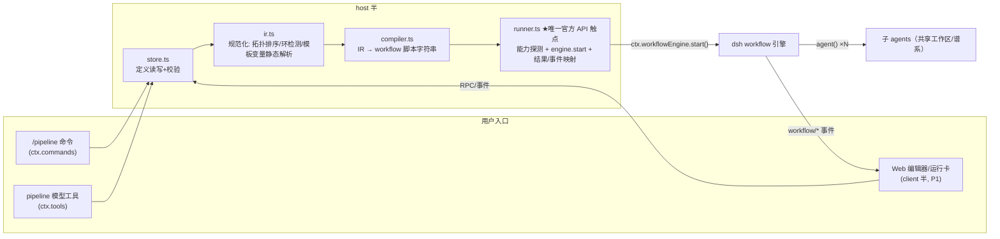

# 架构与技术选型（plan/02）

> 官方 API 依据：dsh-plugin-research/official-docs/subsystems/{workflow,subagent}.zh.md（源文档对应 master @ v0.1.7-rc.2 时期，开发时须按当时 tag 复核——见执行纪律 1）。

## 技术选型决策（详见 plan/06 决策记录表）

| 项 | 选型 | 理由 |
|---|---|---|
| 语言/模块 | TypeScript → ESM（`type: module`，Node ≥ 20） | 与 dsh 生态一致 |
| 分发 | 单 npm 包，双半（host `lib/` + client `web/`） | 参照 dsh-effort-slider 实测 manifest |
| 定义格式 | 纯 JSON（编辑器侧可显示 jsonc 注释，落盘为 JSON） | 可进 git、可分享、可被其他工具生成 |
| 编译目标 | `ctx.workflowEngine` 的普通 JS 脚本（字符串拼接，禁 eval） | 官方一等 seam；插件可作专用消费方直接 start |
| 编排原语 | 顺序 `agent()` + 前次输出注入（P0）；continuable（P2） | 最小失败隔离面；continuable 依赖 `prepareContinuable` 能力 |
| 存储 | 工作区 `.dsh/pipelines/*.json`（`ctx.fs` 读写） | 项目可移植、用户可手改、天然可分享 |
| 测试 | vitest（或 node:test，M0 定）+ 快照 + mock engine；**零 API 依赖可重复** | 方法论阶段 5 要求 |
| UI | P0 无 UI；P1 settings section / 侧栏页 + `ConversationNodeDefinition` 运行卡 | 复用官方渲染路径（dsh-client-ui-workflow-run 先例） |

## 架构图

## 官方依赖面清单（runner.ts 唯一触点，其余模块不得直接 import 引擎类型）

| 依赖 | 用途 | 能力要求 / 备注 |
|---|---|---|
| `ctx.workflowEngine.start(request)` | 发起运行 | `subagentProvider`、`maxTotalAgents` 仅专用消费方可传 |
| `SubagentStartRequest.agentOptions` | FR-6 每节点模型路由 | 需 provider 能力 flag `agentOptions`（in-process 支持） |
| `SubagentStartRequest.toolFilter` | FR-11 节点工具过滤 | 能力 flag `toolFilter` |
| `SubagentProvider.prepareContinuable` | FR-16（P2） | 方法存在即能力，类型收窄探测 |
| `workflow/*` 观察事件 | FR-14 运行卡 | emit 快照，只读；`workflow/end` 无 result value |
| `ctx.skills` | FR-10 技能内容解析 | 注入节点提示词 |
| `ctx.commands` / `ctx.tools` / `ConversationNodeDefinition` | 入口与渲染 | 常规注册，卸载随插件 effect 撤销 |
| `ctx.fs` | 定义存取 | 工作区相对路径 |

## 兼容与风险控制

1. **版本锚定**：`package.json` 声明 `dsh.compatibility.dsh: ">=0.1.0-rc.5"`；发布前按当期 rc 复核全部依赖面（官方明示 preview 期有破坏性变更）。
2. **能力探测降级**：运行前读 provider 的 `SubagentCapabilities`；`agentOptions`/`toolFilter` 不支持 → FR-12 行为（可读错误 + 回落 parent 配置），绝不静默忽略。
3. **防失控**：`maxTotalAgents = f(节点数)` 封顶；编译期拒绝空 prompt、未知模板变量、环依赖、未知模型 id（catalog 校验）；prompt 全部走 JSON 安全拼接。
4. **token 放大治理**：节点可选 `outputSchema` 限制输出形状；M4 的成本徽章让放大可见。
5. **卸载安全**：所有注册走 Cordis effect（官方语义：插件卸载即撤销）；运行中的流水线归属会话，插件停用不影响已在跑的 engine run（引擎是独立服务）。
